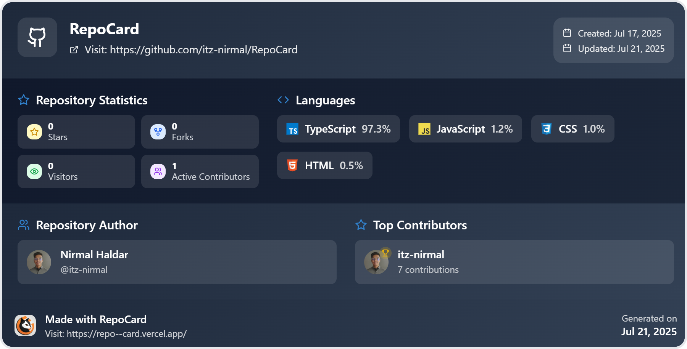

# 🎯 RepoCard - GitHub Repository Report Generator

<div align="center">
  
  
  <h3>✨ Generate Beautiful Report Cards for Your GitHub Repositories ✨</h3>
  
  <p>
    <strong>Transform your GitHub repositories into stunning, professional report cards with comprehensive insights and statistics</strong>
  </p>

  <div>
    
    
    
    
  </div>

  <div style="margin: 20px 0;">
    <a href="https://repo--card.vercel.app/" target="_blank">
      
    </a>
    <a href="https://github.com/itz-nirmal/RepoCard" target="_blank">
      
    </a>
  </div>
</div>

---

## 🌟 Features

### 🎨 **Beautiful Visual Design**

- **Dynamic Color Palettes**: Each report card features unique, algorithmically generated color schemes
- **Interactive Animated Background**: Connected dot pattern with mouse tracking and real-time interactions
- **Responsive Design**: Optimized for all screen sizes and devices
- **Modern UI Components**: Clean, professional interface with smooth animations

### 📊 **Comprehensive Repository Analytics**

- **📈 Repository Statistics**: Stars, forks, watchers, and contributor counts
- **💻 Language Analysis**: Detailed breakdown of programming languages with percentages
- **👥 Contributor Insights**: Top contributors with ranking badges (🏆 Gold, 🥈 Silver, 🥉 Bronze)
- **📅 Timeline Information**: Creation and last update dates
- **🔗 Direct Links**: Quick access to repository and author profiles

### 💾 **Multiple Export Formats**

- **🌐 HTML**: Interactive web-ready format
- **🖼️ PNG**: High-quality image format for sharing
- **📄 PDF**: Professional document format for presentations
- **⚡ Instant Download**: One-click generation and download

### 🎯 **Advanced Functionality**

- **🔍 Smart Repository Detection**: Automatic parsing of GitHub URLs
- **🎨 Dynamic Theming**: Beautiful gradient backgrounds and color schemes
- **📱 Mobile Optimized**: Perfect viewing experience on all devices
- **⚡ Fast Performance**: Optimized React components with efficient rendering

---

## 🚀 Quick Start

### 📋 Prerequisites

Make sure you have the following installed:

- **Node.js** (v16 or higher) 📦
- **npm** or **yarn** package manager 🛠️
- **Git** for version control 🔧

### 🛠️ Installation

1. **Clone the repository**

   ```bash
   git clone https://github.com/itz-nirmal/RepoCard.git
   cd RepoCard
   ```

2. **Install dependencies**

   ```bash
   npm install
   # or
   yarn install
   ```

3. **Start the development server**

   ```bash
   npm run dev
   # or
   yarn dev
   ```

4. **Open your browser**
   ```
   Navigate to http://localhost:5173
   ```

---

## 🎮 How to Use

### 🔗 **Step 1: Enter Repository URL**

- Paste any GitHub repository URL into the input field
- Supports various URL formats:
  - `https://github.com/username/repository`
  - `github.com/username/repository`

### ⚡ **Step 2: Generate Report Card**

- Click the "Generate Report Card" button
- Watch the beautiful loading animation
- The system fetches comprehensive repository data

### 🎨 **Step 3: Customize & Download**

- Each generation creates a unique color palette
- Choose from multiple download formats:
  - **HTML** for web sharing
  - **PNG** for social media
  - **PDF** for presentations

### 🔄 **Step 4: Create More Cards**

- Use "Create Another" to generate cards for different repositories
- Each card maintains its unique visual identity

---

## 🏗️ Project Structure

```
RepoCard/
├── 📁 public/                 # Static assets
│   ├── 🖼️ Favicone.png       # App favicon
│   ├── 🖼️ Footer-Logo.jpg    # Footer logo
├── 📁 src/
│   ├── 📁 components/         # React components
│   │   ├── 🎨 AnimatedBackground.tsx  # Interactive dot pattern
│   │   ├── 🏠 Hero.tsx               # Main landing page
│   │   ├── 📝 InputCard.tsx          # URL input component
│   │   └── 🎯 RepoCard.tsx           # Report card generator
│   ├── 📁 context/            # React context providers
│   ├── 📁 types/              # TypeScript type definitions
│   ├── 📁 utils/              # Utility functions
│   │   ├── 🎨 colorGenerator.ts      # Dynamic color palettes
│   │   ├── 💾 cardDownloader.ts      # Export functionality
│   │   └── 🔧 languageLogos.ts       # Programming language icons
│   ├── 🎨 index.css           # Global styles
│   ├── ⚛️ App.tsx             # Main app component
│   └── 🚀 main.tsx            # App entry point
├── 📄 package.json            # Dependencies and scripts
├── ⚙️ vite.config.ts          # Vite configuration
├── 🎨 tailwind.config.js      # Tailwind CSS config
└── 📝 README.md               # Project documentation
```

---

## 🛠️ Technology Stack

### **Frontend Framework**

- **⚛️ React 18** - Modern React with hooks and functional components
- **📘 TypeScript** - Type-safe development with enhanced IDE support
- **⚡ Vite** - Lightning-fast build tool and development server

### **Styling & UI**

- **🎨 Tailwind CSS** - Utility-first CSS framework for rapid styling
- **🎭 Lucide React** - Beautiful, customizable icon library
- **✨ CSS Animations** - Smooth transitions and interactive effects

### **Core Libraries**

- **🖼️ dom-to-image-more** - High-quality image generation from DOM elements
- **📄 jsPDF** - Client-side PDF generation
- **🎨 Canvas API** - Interactive animated background rendering

### **Development Tools**

- **🔍 ESLint** - Code linting and quality assurance
- **🎯 TypeScript Compiler** - Type checking and compilation
- **📦 npm/yarn** - Package management

---

## 🎨 Key Features Deep Dive

### 🌈 **Dynamic Color Generation**

The application features an advanced color palette generator that creates unique, harmonious color schemes for each report card:

### 🎯 **Interactive Background**

The animated background features:

- **Connected Dots**: Dynamic network visualization
- **Mouse Tracking**: Dots respond to cursor movement
- **Physics Simulation**: Realistic movement and collisions
- **Performance Optimized**: 60fps canvas rendering

### 📊 **Repository Analytics**

Comprehensive data visualization including:

- **Language Distribution**: Percentage breakdown with visual indicators
- **Contributor Rankings**: Top contributors with achievement badges
- **Activity Metrics**: Stars, forks, watchers, and engagement data
- **Timeline Tracking**: Creation and update history

---

## 🚀 Deployment

### **Vercel (Recommended)**

```bash
# Install Vercel CLI
npm i -g vercel

# Deploy to Vercel
vercel

# Follow the prompts for configuration
```

### **Netlify**

```bash
# Build the project
npm run build

# Deploy the dist folder to Netlify
# Or connect your GitHub repository for automatic deployments
```

### **GitHub Pages**

```bash
# Install gh-pages
npm install --save-dev gh-pages

# Add to package.json scripts:
"deploy": "gh-pages -d dist"

# Deploy
npm run build && npm run deploy
```

---

## 🤝 Contributing

We welcome contributions from the community! Here's how you can help:

### 🐛 **Bug Reports**

- Use the GitHub issue tracker
- Provide detailed reproduction steps
- Include screenshots when applicable

### ✨ **Feature Requests**

- Describe the feature and its benefits
- Provide use cases and examples
- Consider implementation complexity

### 🔧 **Pull Requests**

1. Fork the repository
2. Create a feature branch: `git checkout -b feature/amazing-feature`
3. Commit your changes: `git commit -m 'Add amazing feature'`
4. Push to the branch: `git push origin feature/amazing-feature`
5. Open a Pull Request

### 📝 **Development Guidelines**

- Follow TypeScript best practices
- Maintain consistent code formatting
- Add comments for complex logic
- Update documentation as needed

---

## 📄 License

This project is licensed under the **MIT License** - see the [LICENSE](LICENSE) file for details.

```
MIT License

Copyright (c) 2025 itz-nirmal

Permission is hereby granted, free of charge, to any person obtaining a copy
of this software and associated documentation files (the "Software"), to deal
in the Software without restriction, including without limitation the rights
to use, copy, modify, merge, publish, distribute, sublicense, and/or sell
copies of the Software, and to permit persons to whom the Software is
furnished to do so, subject to the following conditions:

The above copyright notice and this permission notice shall be included in all
copies or substantial portions of the Software.
```

---

## 🙏 Acknowledgments

### **Special Thanks**

- **GitHub API** - For providing comprehensive repository data
- **React Community** - For the amazing ecosystem and tools
- **Tailwind CSS** - For the beautiful utility-first styling approach
- **Vercel** - For seamless deployment and hosting

### **Inspiration**

This project was inspired by the need for beautiful, shareable repository summaries that showcase the hard work developers put into their projects.

---

## 📞 Contact & Support

<div align="center">
  
  ### 👨‍💻 **Developer: Nirmal Haldar**
  
  <div>
    <a href="https://github.com/itz-nirmal" target="_blank">
      
    </a>
    <a href="https://linkedin.com/in/itz-nirmal" target="_blank">
      
    </a>
    <a href="mailto:itz.nirmal.haldar@gmail.com" target="_blank">
      
    </a>
  </div>

### 🌐 **Project Links**

  <div>
    <a href="https://repo--card.vercel.app/" target="_blank">
      
    </a>
    <a href="https://github.com/itz-nirmal/RepoCard/issues" target="_blank">
      
    </a>
  </div>

</div>

---

## 📸 Website Output Preview

<div align="center">
  
  
  <p><em>✨ Beautiful, professional repository report cards generated instantly ✨</em></p>
</div>

---

## 📈 Project Stats & Metrics

<div align="center">
  
  ### 🏆 **Live Repository Statistics**
  
  <table>
    <tr>
      <td align="center" valign="top">
        
        <br><strong>⭐ Stars</strong>
      </td>
      <td align="center" valign="top">
        
        <br><strong>🍴 Forks</strong>
      </td>
      <td align="center" valign="top">
        
        <br><strong>🐛 Issues</strong>
      </td>
      <td align="center" valign="top">
        
        <br><strong>🔄 PRs</strong>
      </td>
    </tr>
    <tr>
      <td align="center" valign="top">
        
        <br><strong>📅 Last Commit</strong>
      </td>
      <td align="center" valign="top">
        
        <br><strong>📦 Size</strong>
      </td>
      <td align="center" valign="top">
        
        <br><strong>🔢 Languages</strong>
      </td>
      <td align="center" valign="top">
        
        <br><strong>🏆 Top Language</strong>
      </td>
    </tr>
  </table>

</div>

---

<div align="center">
  <h3>🎉 Thank you for using RepoCard! 🎉</h3>
  <p><em>If you found this project helpful, please consider giving it a ⭐ on GitHub!</em></p>
  
  
  
  <p><strong>Made with ❤️ by the open source community</strong></p>
</div>
